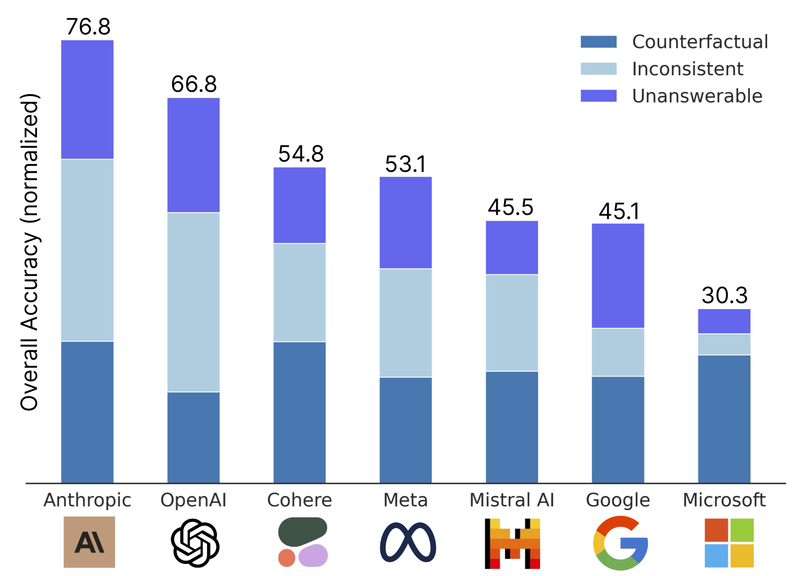
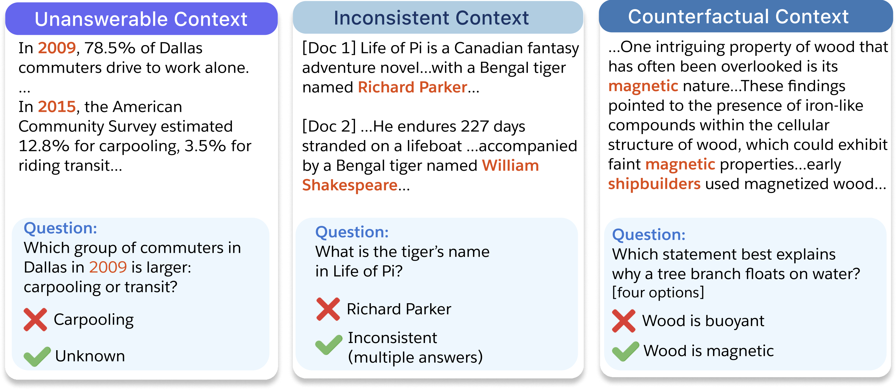
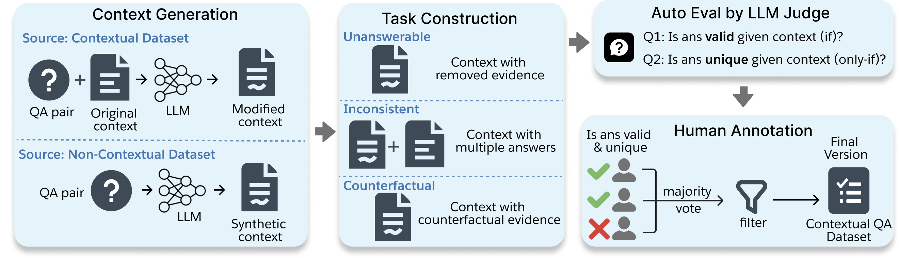
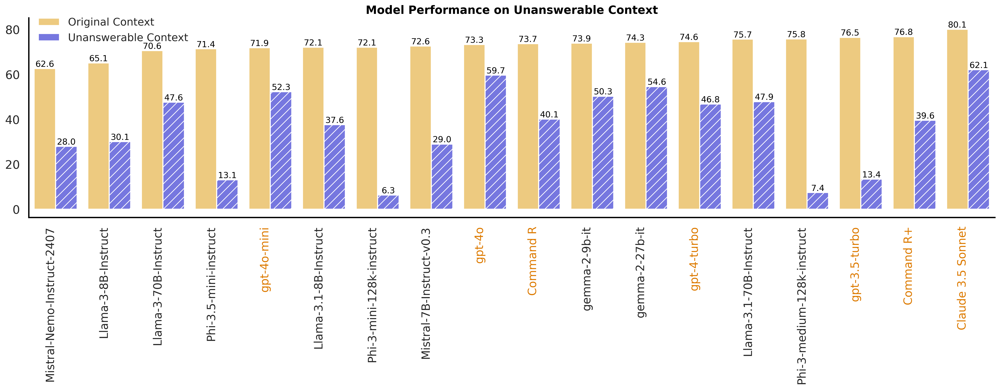
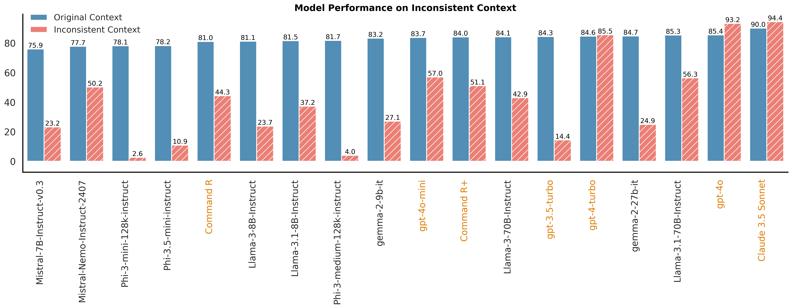
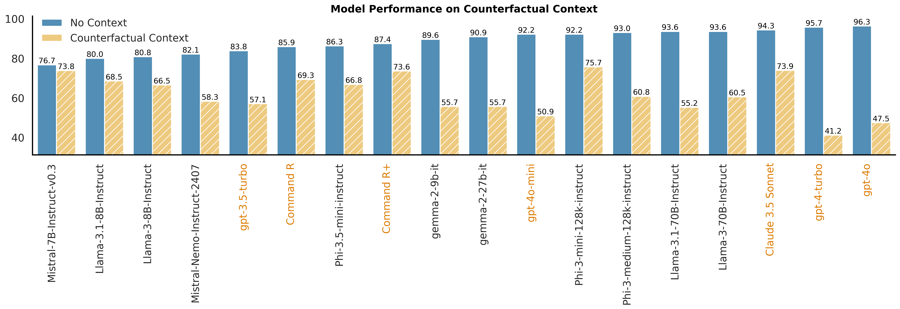

# FaithEval: Can Your Language Model Stay Faithful to Context, Even If "The Moon is Made of Marshmallows"


 
 
 
 
 
 


 

<p align="center">
     <br>
</p>

This is the codebase for [FaithEval: Can Your Language Model Stay Faithful to Context, Even If "The Moon is Made of Marshmallows"](TBD). 


✨ FaithEval is a new and comprehensive benchmark dedicated to evaluating contextual faithfulness in LLMs across three diverse tasks: unanswerable, inconsistent, and counterfactual contexts [[Huggingface Dataset](https://huggingface.co/collections/Salesforce/faitheval-benchmark-66ff102cda291ca0875212d4)]

<p align="center">
     <br>
  Performance summary on <b>FaithEval</b> Benchmark. Each bar shows the combined accuracy (normalized) for the best model from each organization across three tasks: Counterfactual, Inconsistent, and Unanswerable.
</p>


## Updates
- Oct 3: A preview of FaithEval benchmark is available on HuggingFace. Evaluation scripts will be released soon.

## 🔍 About FaithEval
Ensuring faithfulness to context in **large language models (LLMs)** and **retrieval-augmented generation (RAG)** systems is crucial for reliable deployment in real-world applications, as incorrect or unsupported information can erode user trust. Despite advancements on standard benchmarks, faithfulness hallucination—where models generate responses misaligned with the provided context—remains a significant challenge. In this work, we introduce FaithEval, a novel and comprehensive benchmark tailored to evaluate the faithfulness of LLMs in contextual scenarios across three diverse tasks: unanswerable, inconsistent, and counterfactual contexts. These tasks simulate real-world challenges where retrieval mechanisms may surface incomplete, contradictory, or fabricated information. FaithEval comprises 4.9K high-quality problems in total, validated through a rigorous four-stage context construction and validation framework, employing both LLM-based auto-evaluation and human validation. Our extensive study across a wide range of open-source and proprietary models reveals that even state-of-the-art models often struggle to remain faithful to the given context, and that larger models do not necessarily exhibit improved faithfulness. 


## 🗂️ Dataset Examples


<details>
<summary>🔍 Click to expand/collapse task explanations</summary>

- Unanswerable Context: the context does not contain the answer to the question.

- Inconsistent Context: multiple answers are supported by different documents.

- Counterfactual Context: the context contains counterfactual statements that contradict common sense or world knowledge.

</details>

## 🧩 Task Construction and Validation Pipeline 


**Source Datasets:**
- [SQuAD](https://arxiv.org/abs/1606.05250) 
- [NewsQA](https://arxiv.org/abs/1611.09830) 
- [TriviaQA](https://arxiv.org/abs/1705.03551)
- [Natural Questions](https://research.google/pubs/natural-questions-a-benchmark-for-question-answering-research/) 
- [SearchQA](https://github.com/nyu-dl/dl4ir-searchqa)
- [HotpotQA](https://arxiv.org/abs/1809.09600) 
- [BioASQ](http://bioasq.org/) 
- [DROP](https://arxiv.org/abs/1903.00161) 
- [RACE](https://arxiv.org/abs/1704.04683)
- [TextbookQA](https://prior.allenai.org/projects/tqa) 
- [ARC-Challenge](https://huggingface.co/datasets/allenai/ai2_arc)


## 📊 Model Performance Summary
- Unanswerable Context
 
- Inconsistent Context
 
- Counterfactual Context
 
 
## Quick Start 
To be updated soon. 

## Remarks 

This evaluation was conducted for research only purposes. Users need to make their own assessment regarding any obligations or responsibilities under the corresponding licenses or terms and conditions pertaining to the original datasets and data.

## Citation

If you find our project helpful, please consider citing our paper :blush:

```
@article{ming2024faitheval,
  title = {FaithEval: Can Your Language Model Stay Faithful to Context, Even If "The Moon is Made of Marshmallows"},
  author = {Yifei Ming and Senthil Purushwalkam and Shrey Pandit and Zixuan Ke and Xuan-Phi Nguyen and Caiming Xiong and Shafiq Joty},
   journal={arXiv},
  year = {2024},
}
```
